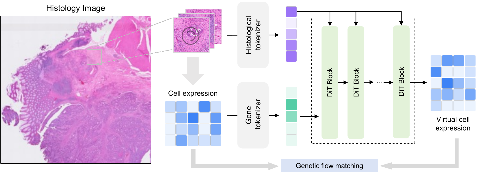

# GeneFlow

GeneFlow is a flow-matching framework for inferring spatially resolved gene
expression from histology images. It combines histology embeddings with a
learned gene tokenizer and a DiT-style backbone to generate virtual expression
profiles.



## Installation

Clone the repository and create the Conda environment:

```bash
git clone https://github.com/YOUR_USERNAME/GeneFlow.git
cd GeneFlow
conda env create -f environment.yml
conda activate geneflow_env
```

The default scripts target CUDA GPUs. Adjust the PyTorch installation in
`environment.yml` if your CUDA version requires a different build.

## Dataset Preparation

The cohorts used by this code follow the file naming and directory conventions
of the [HEST](https://github.com/mahmoodlab/HEST) dataset.

An example cohort can be downloaded with:

```bash
python dataset_download.py \
  --dataset her2st \
  --base_path ./hest1k_datasets
```

If Hugging Face authentication is required, provide the token through the
environment rather than storing it in source code:

```bash
export HF_TOKEN="your_token"
```

GeneFlow expects precomputed [UNI](https://github.com/mahmoodlab/UNI) and
[CONCH](https://github.com/mahmoodlab/CONCH) patch embeddings. Embedding
extraction is not included in this initial release.

The expected dataset structure is:

```text
hest1k_datasets/DATASET_NAME/
├── st/
│   └── SLIDE_ID.h5ad
└── processed_data/
    ├── all_slide_lst.txt
    ├── selected_gene_list_1k.txt
    ├── 1spot_uni_ebd/
    │   └── SLIDE_ID_uni.pt
    ├── 1spot_conch_ebd/
    │   └── SLIDE_ID_conch.pt
    ├── 1spot_uni_ebd_aug/
    │   └── SLIDE_ID_uni_aug.pt
    └── 1spot_conch_ebd_aug/
        └── SLIDE_ID_conch_aug.pt
```

Each augmented embedding file is expected to contain one set of candidate
augmentations per spatial spot.

## Training

GeneFlow uses PyTorch Distributed Data Parallel. Launch a single-GPU run with
`torchrun`; for multiple GPUs, set both process counts to the same value.

```bash
torchrun --nnodes=1 --nproc_per_node=1 geneflow_train.py \
  --num_workers 1 \
  --expr_name her2st \
  --data_path ./hest1k_datasets/her2st/ \
  --results_dir ./results/her2st/runs/ \
  --slide_out SPA148
```

Run `python geneflow_train.py --help` for all model, flow, data, and logging
options. SwanLab logging is optional and enabled with `--use_swanlab`.

A training run creates:

```text
results/DATASET_NAME/runs/000/
├── checkpoints/
│   └── 0005000.pt
├── samples/
├── config.json
└── log.txt
```

Checkpoints retain model, EMA, and optimizer state dictionaries.

## Sampling

Generate expression profiles for a held-out slide with:

```bash
python geneflow_sample.py \
  --data_path ./hest1k_datasets/PRAD/ \
  --slide_out MEND145 \
  --ckpt ./results/PRAD/runs/000/checkpoints/0015000.pt \
  --save_path ./results/PRAD/runs/000/samples/
```

The sampling model arguments must match the values used to create the
checkpoint. Run `python geneflow_sample.py --help` for the full list.

## Evaluation

Open `eval.ipynb`, set the dataset root, slide ID, generated sample path, and
image filename in the configuration cells, then run the notebook to calculate
PCC, MAE, MSE, RVD, and gene-level visualizations.

## Citation

The GeneFlow citation will be added when it becomes available.

## Acknowledgements

The repository structure and portions of the training pipeline are adapted from
[Stem](https://github.com/SichenZhu/Stem). The transformer backbone builds on
[DiT](https://github.com/facebookresearch/DiT). Dataset organization follows
[HEST](https://github.com/mahmoodlab/HEST), and image conditioning uses UNI and
CONCH embeddings. See `NOTICE` for license details.

## License

GeneFlow is released under the Creative Commons Attribution-NonCommercial 4.0
International license. See `LICENSE` and `NOTICE`.
